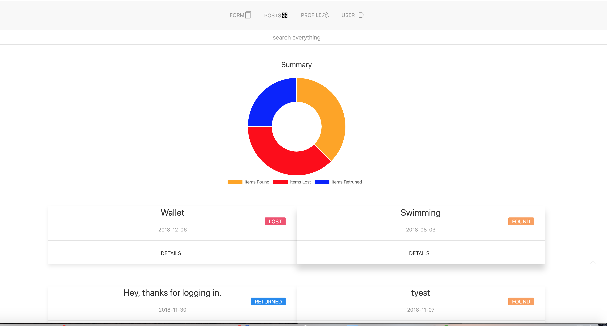

## Vue itemfinder

> A Vue.js project using firebase to allow students at the univeristy of maryland to mark locations using google maps, and post information about items they may have lost or found around campus and where they may have left them. The main need for this site is that UMDPD, although effective, sometimes has a delay of when they can get to each building to collect the found items and enter them into their own database/website. With that, I made a simple app where people can post what they found or lost, and where they left it. 

## [Preview is live](https://cricketthomas.github.io/vuefinder/)
login with: 
user: test@test.com
password: 123456

# Future Plans:
1.[ Offer the option to view the locations address rather than a pin](https://developers.google.com/maps/documentation/javascript/examples/geocoding-reverse#try-it-yourself)



## Build Setup

``` bash
# install dependencies
npm install

# serve with hot reload at localhost:8080
npm run dev

# build for production with minification
npm run build
```

For detailed explanation on how things work, consult the [docs for vue-loader](http://vuejs.github.io/vue-loader).
