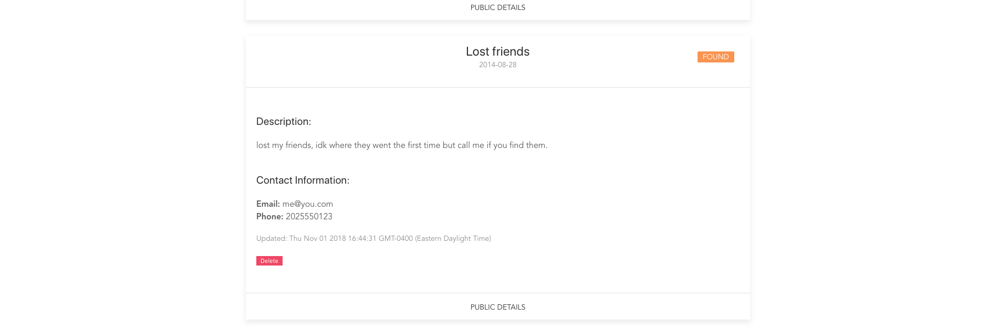

# vue-finder

> A Vue.js project using firebase to allow students at the univeristy of maryland to mark locations using google maps, and post information about items they may have lost or found around campus and where they may have left them. The main need for this site is that UMDPD, although effective, sometimes has a delay of when they can get to each building to collect the found items and enter them into their own database/website. With that, I made a simple app where people can post what they found or lost, and where they left it. 

## Laundry list: Demo is live: https://cricketthomas.github.io/vuefinder/
### Not in order to be created. 
1. ~~Loading page.~~ 
2. ~~User post page for all personal posts, and an edit, save, and cancel button and crud button~~
3. ~~Graph for lost items found and not found~~
4. ~~Add found/not found so people can mark items them found~~ **Style binding for them and hide them if they are found.** 
5. ~~Unique post url~~
6. ~~**Security rules matter alot for this**~~ Added user based security rules
7. ~~[call back for loading](https://github.com/vuejs/vuefire/blob/master/README.md)~~
8. ~~Polish Pages data output and search functionality.~~
9. ~~Data Validation.~~
10. ~~Style~~
11. [Unit Test](https://www.youtube.com/watch?v=d2QKTNmU-Tc) [Vue Test Utils](https://vue-test-utils.vuejs.org/)
12. ~~Publish to Github project pages. ~~


# Future Plans:
1.[ Offer the option to view the locations address rather than a pin](https://developers.google.com/maps/documentation/javascript/examples/geocoding-reverse#try-it-yourself)

# [Demo is live!! Needs some work still..](https://cricketthomas.github.io/vuefinder/)
## ~~Some screenshots of it:
not quite done, but just wanted to show you if youre curious. 




~~
## Build Setup

``` bash
# install dependencies
npm install

# serve with hot reload at localhost:8080
npm run dev

# build for production with minification
npm run build
```

For detailed explanation on how things work, consult the [docs for vue-loader](http://vuejs.github.io/vue-loader).
